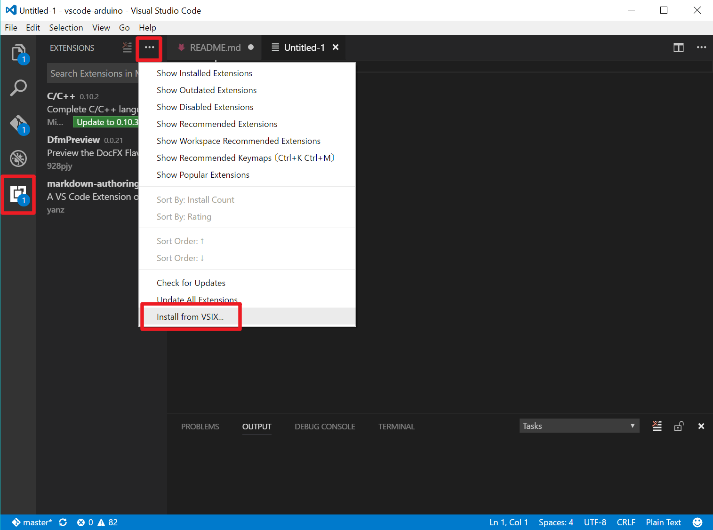

# Arduino for Visual Studio Code

Welcome to **Arduino** for Visual Studio Code! The Arduino extension makes it easy to code, build and deploy your Arduino sketches in Visual Studio Code.

* Verify and upload your Arduino sketches in Visual Studio Code.
* Built-in Arduino board and library manager.
* Built-in Arduino example list.
* Built-in serial port monitoring tool.
* IntelliSense support and syntax highlighting based on C++ for VSCode.
* Snippets for \*.ino files.
* Automatic Arduino project initialization for \*.ino file.
* Commond Palette(F1) integration for most common Arduino commands (e.g. Verify, Upload...).

## Prerequisites

- [Arduino IDE](https://www.arduino.cc/en/main/software). Please choose stable version for your operating system.
- [Visual Studio Code](https://code.visualstudio.com/#alt-downloads)
- [C/C++ for Visual Studio Code](https://marketplace.visualstudio.com/items?itemName=ms-vscode.cpptools). Follow the steps to install or update to version 0.10.5 or later.

## Using
- First, open your Visual Studio Code to install the **vscode-arduino** extension manually from Extensions Activity Bar.

- Open your Arduino sketch folder or create an \*.ino file. Choose your Arduino board from status bar to get started.

## Commands
This extension provides several commands in the Command Palette (**F1** or **Ctrl+Shift+P**) for working with `*.ino` files:

- **Arduino: Boards Manager**: Manage development platforms for additional boards. You can add 3rd party Arduino board / Additional Board Manager URLs in Boards Manager.
- **Arduino: Change Baud Rate**: Change the band rate of current serial port communication.
- **Arduino: Change Board Type**: Show the list of installed board. Switch your board type or platform.
- **Arduino: Close Serial Monitor**: Stop serial monitoring tool and release the occupied serial port.
- **Arduino: Examples**: Show example list.
- **Arduino: Initialize**：Initialize your Arduino project.
- **Arduino: Libraries Manage**: Show a list of libraries that are already installed or ready for installation.
- **Arduino: Open Serial Monitor**: Open serial monotoring tool in the intergrated output window.
- **Arduino: Select Serial Port**: List all avaliable serial ports. Switch the serial port you want to use. 
- **Arduino: Send Text to Serial Port**: Send a line of text via the specified serial port.
- **Arduino: Upload**: Build your sketch file and deploy (upload) to your Arduino board via serial port.
- **Arduino: Verify**: Build (verify) your sketch files.

## Supported Operating Systems
Currently this extension supports the following operatings systems:

- Windows 7 and later (32-bit and 64-bit)
- macOS 10.10 and later
- Ubuntu 16.04
